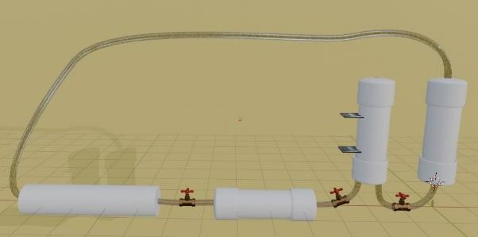
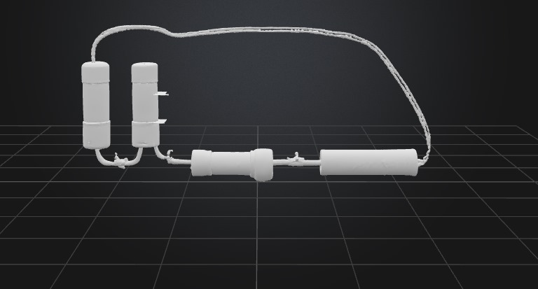
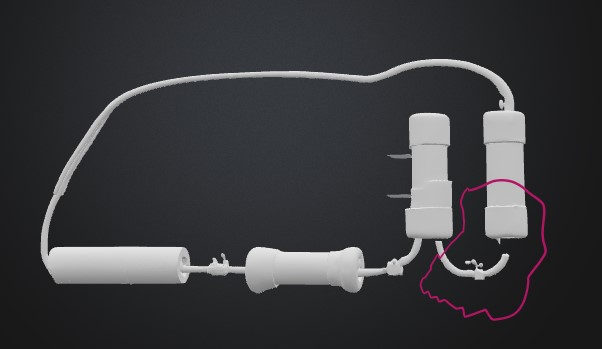
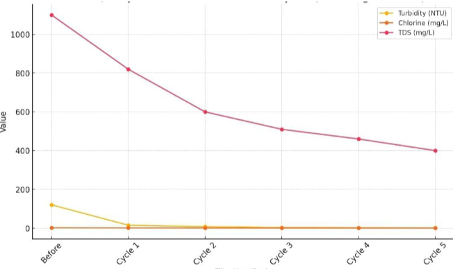
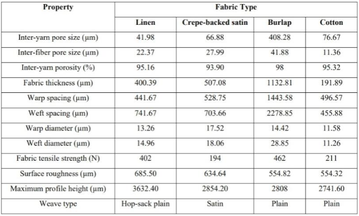
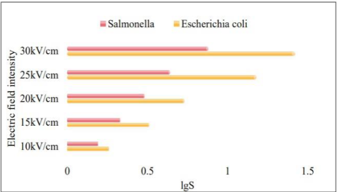
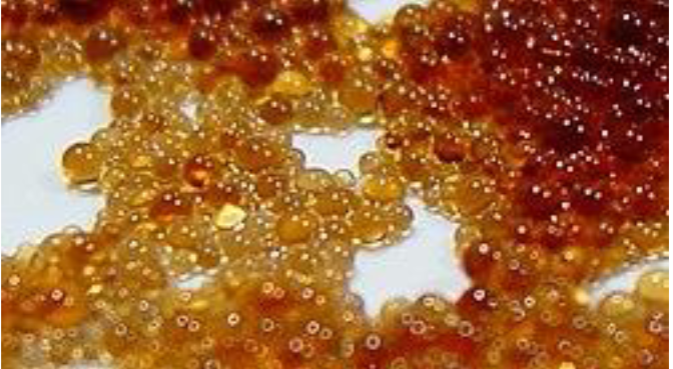

# Project Journal: Smart Air Filtration Tower

## Objective
To develop a **3D-modeled smart air filtration tower** through a combination of **computer-aided design**, **material analysis**, **airflow simulation**, and thorough **documentation**. The project emphasizes technical depth and sustainability.

---
## info about my Journey
###  Total Duration: **96 hours**
###  Duration: **21 days**
###  Start Date: **12 June 2025**
###  End Date: **2 July 2025**

---

## Daily Log

### Day 1 (12/6/2025) – 4 hours  
- Ideated around core functionality of an outdoor smart filtration tower  
- Sketched conceptual models  
- Started basic 3D modeling of tower body  

### Day 2 (13/6/2025) – 4 hours  
- Improved cylindrical geometry in CAD software  
- Researched urban air filtration methods (HEPA vs. activated carbon)  
- Documented CAD dimensions  

### Day 3 (14/6/2025) – 5 hours  
- Integrated vent slats and hollow chambers into 3D design  
- Compared pressure drop rates in vertical vs. horizontal filtering  
- Created BOM draft for early-stage materials  

### Day 4 (15/6/2025) – 4 hours  
- Ran preliminary airflow simulations (passive draw)  
- Evaluated results vs. desired flow rate  
- Adjusted vent geometry  

### Day 5 (16/6/2025) – 5 hours  
- Simulated particle behavior across filters  
- Researched sustainable materials like coconut-shell carbon and aluminum mesh  
- Logged simulation values into documentation  

### Day 6 (17/6/2025) – 4 hours  
- Began cost and supplier comparison of key materials  
- Integrated inlet sensors into design  
- Wrote analysis of suitable filters for Egypt’s urban air quality  

### Day 7 (18/6/2025) – 4 hours  
- Researched sensor placement strategies  
- Modeled airflow-guiding vanes to increase efficiency  
- Refined front-end mesh design  

### Day 8 (19/6/2025) – 5 hours  
- Calculated airflow in m³/min across chambers  
- Documented methodology for CFD simulation  
- Rendered early design prototype  

### Day 9 (20/6/2025) – 4 hours  
- Re-evaluated simulation results with adjusted temperature and pressure  
- Wrote progress documentation section  
- Consulted academic paper on filtration efficiency  

### Day 10 (21/6/2025) – 4 hours  
- Optimized air outlet shape  
- Cross-compared three materials for outer casing (PVC vs. Aluminum vs. Recycled Plastic)  
- Calculated expected operating temperature range  

### Day 11 (22/6/2025) – 5 hours  
- Modeled base platform with cable routing  
- Finalized 3D chamber segmentation  
- Prepared simulation video exports  

### Day 12 (23/6/2025) – 4 hours  
- Integrated digital display box into model  
- Documented temperature sensor placement  
- Exported technical drawings  

### Day 13 (24/6/2025) – 4 hours  
- Simulated variable-speed fan integration  
- Researched noise reduction techniques  
- Wrote BOM with updated unit costs  

### Day 14 (25/6/2025) – 5 hours  
- Conducted cost-to-efficiency analysis of final filter configuration  
- Improved airflow simulation mesh resolution  
- Designed branding plate  

### Day 15 (26/6/2025) – 4 hours  
- Finalized 3D rendering with textures  
- Compiled simulation results  
- Created logo and interface icons  

### Day 16 (27/6/2025) – 4 hours  
- Documented use-case scenarios (urban, factory perimeter, schools)  
- Wrote methodology chapter for final report  
- Searched environmental data from Cairo for validation  

### Day 17 (28/6/2025) – 5 hours  
- Modeled transportable modular variant  
- Designed solar-powered fan extension  
- Calculated battery storage requirements  

### Day 18 (29/6/2025) – 4 hours  
- Refined edge fillets for manufacture-readiness  
- Finalized CAD file  
- Prepared code blocks for sensor control (pseudo-code)  

### Day 19 (30/6/2025) – 4 hours  
- Conducted peer review with teammates  
- Integrated their feedback into final report  
- Exported manufacturing-ready files  

### Day 20 (1/7/2025) – 4 hours  
- Reviewed documentation and corrected structure  
- Ensured citation of technical sources  
- Proofread entire journal  

### Day 21 (2/7/2025) – 4 hours  
- Submitted final files  
- Compiled and packaged project repository  
- Archived simulation runs and 3D exports  

---

## Images
-   
- 
- 
- 
- 
- 
- 