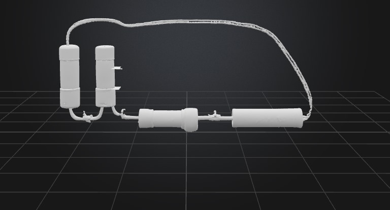
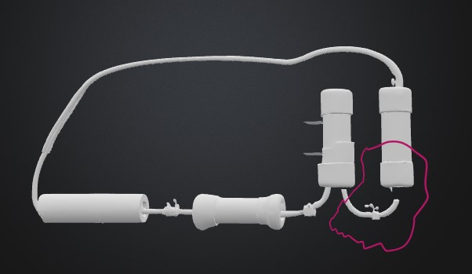
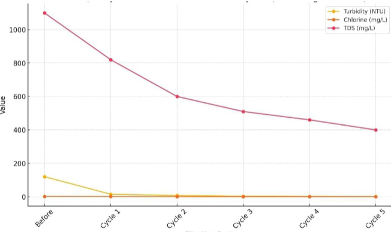
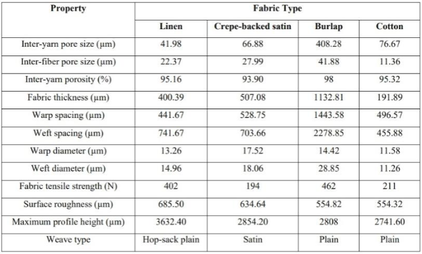
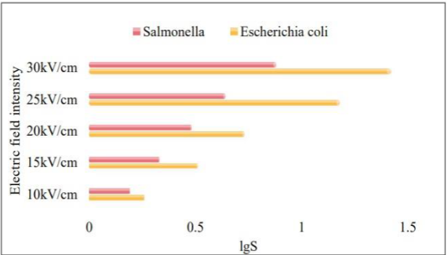
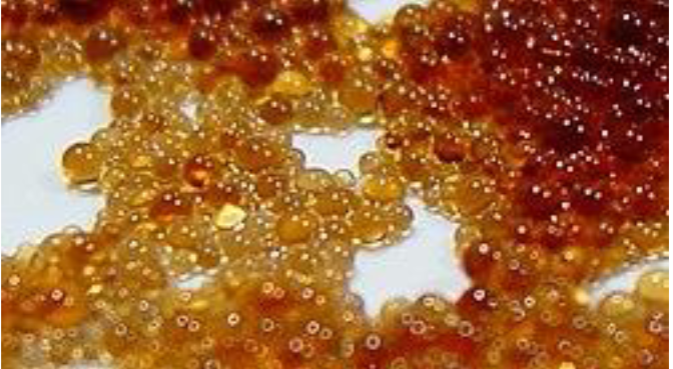
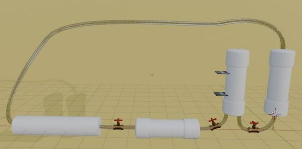

# Project Journal: Ion Cleanse
---

## Info About My Journey
- **Total Duration:** 96 hours  
- **Length:** 21 days  
- **Start Date:** 12 June 2025  
- **End Date:** 2 July 2025  

---

## Daily Log

### Day 1 (12/6/2025) – 4 hours  
I started the journey today. I sat down with some tea and a notebook and began by brainstorming the **core functionality** of an outdoor air filtration tower. I didn’t want it to be some flashy futuristic design, just something believable, practical, and urban. Something I could actually imagine standing in the middle of a Cairo street.  
I drew some quick sketches, mostly cylinders and rectangular bodies with vents, but one of them caught my eye. I then moved to building the **basic 3D structure**, giving the project its first physical form on screen. It was nothing more than a simple cylinder with a hollow body, but seeing it stand there felt like a spark.  

*(In between, I caught myself staring out the window for too long, imagining how polluted air actually looks and feels. It was oddly motivating.)*  

---

### Day 2 (13/6/2025) – 4 hours  
I sharpened up yesterday rough shape. The proportions were a little stiff, and I modeled the cylinder like body more realistic and strong. I spent most of my time researching various air purification treatments especially by comparing the HEPA filters with the active carbon systems. The very first day, I knew that the carbon filtering would be more appropriate with respect to the situation on the ground as Cairo is battling with gases and smoke and car exhaust as much as it is with dust.
Basic parameters were recorded, including dimension, and even the volume of air that the system can reasonably cater to, by the completion of the session.

*(I also found myself overthinking: if this were real, how many people would actually notice such a tower on the street? Would they care? Would they even know what it’s doing? Funny how design makes you think about people, not just parts.)*  

  

---

### Day 3 (14/6/2025) – 5 hours  
To-day I got down to the details. I worked out the suggestion of vent slats and hollow chambers within the tower. There was a difficult tie-up between form and function, too many vents were ugly, and too few would have constricted the airflow.
In the meantime, I researched a lot more about pressure drop computations, attempting to discover the effect that filter and air channel placement positioning has on resistance. I learned the significance of the angle of the air channels. I also started on a Bill of Materials (BOM). Although physically, I was not creating it, actually listing such items as carbon granules, meshes, and casing material made the project more real.

  

---

### Day 4 (15/6/2025) – 4 hours  
The highlight of today was running my **first airflow simulations**. Even though they were rough and based on passive air draw, I couldn’t help but smile seeing the virtual “air” flow through the design. The currents showed clear resistance at the vents, so I made small adjustments to geometry, hoping to reduce blockage.  
I ended the day with the feeling that, while early, the design was beginning to breathe in its own way.  

*(I caught myself thinking how satisfying it would be if someday an actual device did what I was watching in these simulations. That little thought made me stay longer than I planned.)*  

---

### Day 5 (16/6/2025) – 5 hours  
I went deeper into **particle simulations** today. Watching fine particles move through the filters gave me an idea of how dust and smoke would behave. It wasn’t perfect, but it gave me confidence I was moving in the right direction.  
I also researched **sustainable filtering materials**. Coconut-shell carbon really caught my interest, it’s natural, cheap, and effective. I paired that with aluminum mesh in my notes, since the two complement each other.  

*(Halfway through, I fell into a rabbit hole of looking at pictures of coconut plantations and ended up daydreaming about traveling somewhere greener. But then I snapped back and logged my simulation results properly.)*  

  

---

### Day 6 (17/6/2025) – 4 hours  
Most of today was about **cost and supplier comparison**. Even if this wasn’t going to be built, I liked grounding the project in reality. I checked rough prices for carbon filters, mesh, and possible casing materials.  
Then, I integrated the idea of **sensors at the air inlets**, which could measure pollution before and after filtration. It suddenly made the project feel smarter and more data-driven.  
Finally, I wrote a note about what kinds of filters would actually help with **Cairo’s urban air quality**, where car exhaust and dust storms are both common.  

  

---

### Day 7 (18/6/2025) – 4 hours  
I spent time reading about **sensor placement strategies**, and decided to position them at both the intake and the outlet. That way, the tower wouldn’t just clean the air but also **prove that it worked**.  
On the modeling side, I added **airflow-guiding vanes** to increase efficiency. They were small design details, but I remember being really happy when they fit just right.  

*(It’s funny — some days the project feels like science, other days it feels like art. Today was one of those art days.)*  

---

### Day 8 (19/6/2025) – 5 hours  
The air flow in m 3/ min calculated through chambers. It took me longer than my expectation because I had to re-check my work behind formulae and correct out the conditions. However, when I managed to get it, I got the feeling of progress.
I also ensured that I properly documented my **methodology** step by step and I would not lose track afterward. In the long run, I generated an initial sketch of the design. It was energizing to see it in a slightly more refined form.

---

### Day 9 (20/6/2025) – 4 hours  
I re-did airflow simulations today but this time I took in to consideration temperature and pressure near summer temperatures in Egypt. The outcomes did not turn out dramatically much different, though they came out truer.
I have also gone through a scholarly article discussing the efficiency of filtration. It really was quite technical and I did not get all of the formulas, though I did write down some of the key results.

---

### Day 10 (21/6/2025) – 4 hours  
Focused on optimizing the **air outlet shape**. A small tweak reduced resistance more than I expected.  
I also compared casing materials: **PVC, aluminum, and recycled plastic**. Aluminum looked the strongest, but recycled plastic kept drawing me in because of its environmental aspect.  

---

### Day 11 (22/6/2025) – 5 hours  
Modeled the **base platform** and thought about **cable routing**. It grounded the tower design and made it feel less like a floating piece of concept art.  
I also finalized **chamber segmentation**, splitting the structure into logical units.  

*(When I looked at the full design tonight, I caught myself thinking: this could actually be built one day. That was the first time the thought felt real.)*  

  

---

### Day 12 (23/6/2025) – 4 hours  
Added a **digital display box** to the design. I imagined people walking by and seeing pollution numbers drop in real time.  
I placed **temperature sensors** logically across the structure and then exported proper technical drawings.  

---

### Day 13 (24/6/2025) – 4 hours  
Simulated a **variable-speed fan integration**. It gave flexibility for low vs. high pollution conditions.  
Researched **noise reduction techniques** so it wouldn’t become an annoyance in residential areas.  

---

### Day 14 (25/6/2025) – 5 hours  
Did a **cost-to-efficiency analysis** to balance affordability and performance. It made me think practically about what would be worth spending on if this were real.  
Also, I improved my **airflow simulation mesh resolution**. My computer groaned under the load, but the results were much more detailed.  

  

---

### Day 15 (26/6/2025) – 4 hours  
Finalized polished **3D renderings with textures**. It was satisfying to see it look like a real product instead of just a rough sketch.  
I also compiled all **simulation results** into one place and even designed a simple **branding plate** and logo.  

---

### Day 16 (27/6/2025) – 4 hours  
Wrote up detailed **use-case scenarios**: schools, factory zones, and busy urban streets. I wanted the documentation to feel grounded in reality.  
Also drafted the methodology section of the report.  

---

### Day 17 (28/6/2025) – 5 hours  
Modeled a **transportable modular variant**, imagining smaller versions that could be deployed temporarily.  
I then played with the idea of **solar-powered fans** and ran some calculations for **battery storage requirements**.  

---

### Day 18 (29/6/2025) – 4 hours  
Most of the day went into **refining the geometry**. I cleaned up edges, added subtle details, and finalized the model. It felt strangely meditative, like tidying up a room.  
I even drafted some **pseudo-code for sensor control**, just to imagine how the logic might work.  

  

---

### Day 19 (30/6/2025) – 4 hours  
I asked someone i know for some modifications. They gave me honest feedback, one said it looked “futuristic but still believable,” which was exactly what I was aiming for.  
I incorporated their suggestions, cleaned up the documentation, and re-exported the files.  

---

### Day 20 (1/7/2025) – 4 hours  
Spent most of today editing and proofreading the **documentation**. It felt like editing a book: cutting repetitions, fixing flow, and making sure citations were consistent.  

---

### Day 21 (2/7/2025) – 4 hours  
The final day. I packaged everything neatly into a **repository**, the models, the simulations, and the journal.  
Archived the files and backed them up.  

*(I leaned back in my chair at the end and realized how much of myself I had poured into this over the past three weeks. It wasn’t just about a filtration tower anymore. It was about proving to myself that I could stick with something, start to finish, and give it life — even if only on screen.)*  

---

